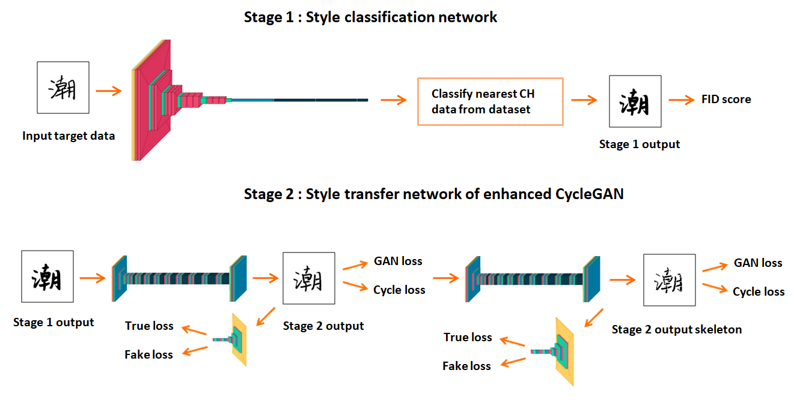

# CChGANOnly25Examples: Chinese Handwritten Style Transfer Using Only 25 Target Examples


## Abstract
Chinese handwritten style transfer is a challenging task because there are more than ten
thousands of different characters and at least 3,000 of them are commonly used. Most
of the existing methods requires more than 100 characters as target examples. In this
paper we propose a Chinese character style transfer system that use 25 target examples.
First, a fixed set of the 25 characters is carefully selected. Then, Fréchet Inception
Distance (FID) is used to find the reference font for style transfer. Third, skeleton
information is added to a typical CycleGAN model to improve the quality of transferred
characters. FID is used again to evaluate the results and our method outperforms other
compared methods.


## Network Structure


We propose a two-stage Chinese font generative system. Stage 1 classify the nearest source style for stage 2 style transfe.

## Stage 1 Usage

Install from [pip](https://pypi.org/project/pytorch-fid/):

```
pip install pytorch-fid
```

Requirements:
- python3
- pytorch
- torchvision
- pillow
- numpy
- scipy

To compute the FID score between two styles of font images, where images of each style are contained in an individual folder:
```
python -m pytorch_fid path/to/source path/to/target
```

## Stage 2 Usage
### 1. Setup the dataset

You can prepare your own Chinese font style transfer dataset by setting up the following directory structure:

    .
    ├── datasets                   
    |   ├── <dataset_name>         # i.e. brucewayne2batman
    |   |   ├── train              # Training
    |   |   |   ├── A              # Contains target style font images (i.e. Senty Pea)
    |   |   |   └── B              # Contains source style font images (i.e. Senty Golden Bell)
    |   |   |   └── C              # Contains target style Skeletonized font images (i.e. Senty Pea)
    |   |   └── test               # Testing
    |   |   |   ├── A              # Contains target style font images (i.e. Senty Pea)
    |   |   |   └── B              # Contains source style font images (i.e. Senty Golden Bell)
    
### 2. Train
```
python train.py --cuda --dataroot datasets/<dataset_name>/ --input_nc 1 --output_nc 1  --n_epochs 81 --batchSize 5  --decay_epoch 80

```
This command will start a training session using the images under the *dataroot/train* directory with the hyperparameters that showed best results according to CycleGAN authors. You are free to change those hyperparameters, see ```./train --help``` for a description of those.

If you don't own a GPU remove the --cuda option, although I advise you to get one!

## Testing
```
python test.py --dataroot datasets/<dataset_name>/ --cuda --input_nc 1 --output_nc 1 --generator_A2B output/79_netG_A2B.pth  --generator_B2A output/79_netG_B2A.pth
```
This command will take the images under the *dataroot/test* directory, run them through the generators and save the output under the *output/A* and *output/B* directories. You are free to change those hyperparameters, see ```./test --help``` for a description of those.

## Acknowledgements
Stage 1 code derived and rehashed from:

* [FID score for PyTorch](https://github.com/mseitzer/pytorch-fid) by [mseitzer](https://github.com/mseitzer)

Stage 2 code derived and rehashed from:

* [Generating handwritten Chinese characters using CycleGAN](https://github.com/ZC119/Handwritten-CycleGAN) by [ZC119](https://github.com/ZC119)

## Citing

If you use this repository in your research, consider citing it using the following Bibtex entry:

```
@misc{gvgip,
  author = {{Chung-Che Wang, Hsien-Yao Shui, Jyh-Shing Roger Jang}},
  title = {{Chinese Handwritten Style Transfer Using Only 25 Target Examples}},
  howpublished = "The 34th IPPR Conference on Computer Vision, Graphics, and Image Processing (CVGIP)",
  year = 2021,
}
```

## License

Stage 1: Apache 2.0

Stage 2: GPL v3

Util: Apache 2.0
